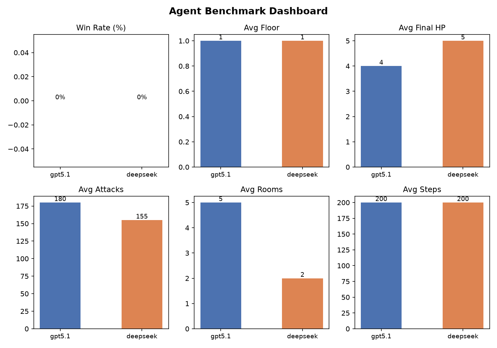
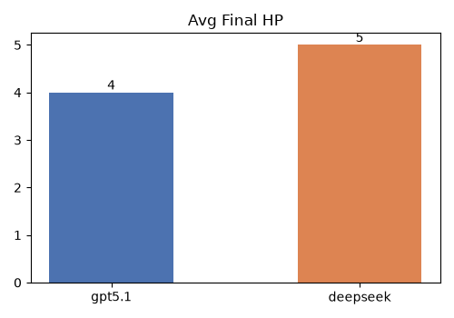
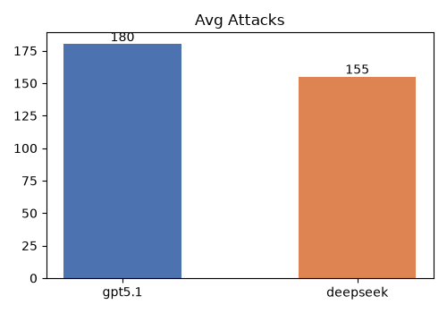
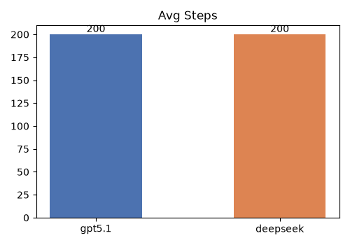
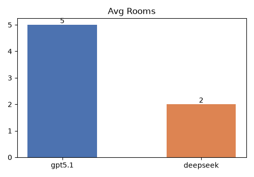
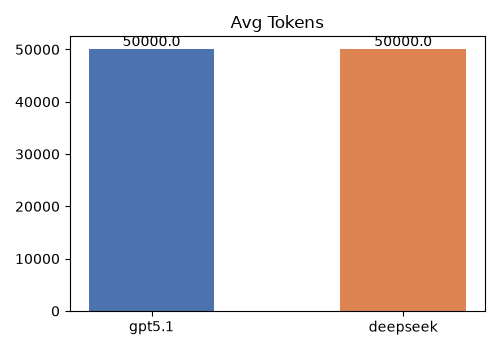

# AI Agent Benchmark Results

Run at: 2026-06-17 12:30:00
Seeds: 0–2 (3 games per agent)

## Summary

| Agent | Win Rate | Avg Floor | Max Floor | Avg Final HP | Avg Attacks | Avg Steps | Avg Tokens | Max Room |
|-------|----------|-----------|-----------|-------------|-------------|-----------|------------|----------|
| gpt5.1 | 0% (0/3) | 1.0 | 1 | 4 | 180 | 200 | 50000 | 5 |
| deepseek | 0% (0/3) | 1.0 | 1 | 5 | 155 | 200 | 50000 | 2 |

## Per-Game Results

### gpt5.1

| Seed | Won | Reason | Floors | Final HP | Attacks | Steps | Tokens |
|------|-----|--------|--------|----------|---------|-------|--------|
| 0 | No | budget_exhausted | 1 | 4 | 175 | 198 | 50000 |
| 1 | No | budget_exhausted | 1 | 3 | 188 | 205 | 50000 |
| 2 | No | budget_exhausted | 1 | 5 | 177 | 195 | 50000 |

### deepseek

| Seed | Won | Reason | Floors | Final HP | Attacks | Steps | Tokens |
|------|-----|--------|--------|----------|---------|-------|--------|
| 0 | No | budget_exhausted | 1 | 5 | 152 | 210 | 50000 |
| 1 | No | budget_exhausted | 1 | 6 | 160 | 190 | 50000 |
| 2 | No | budget_exhausted | 1 | 4 | 153 | 200 | 50000 |

## Plots

.png)

